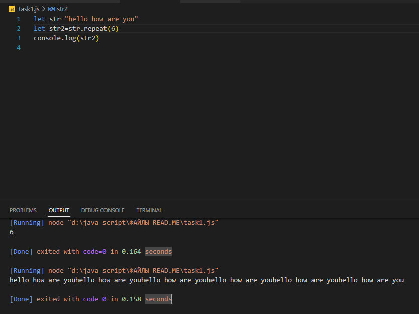
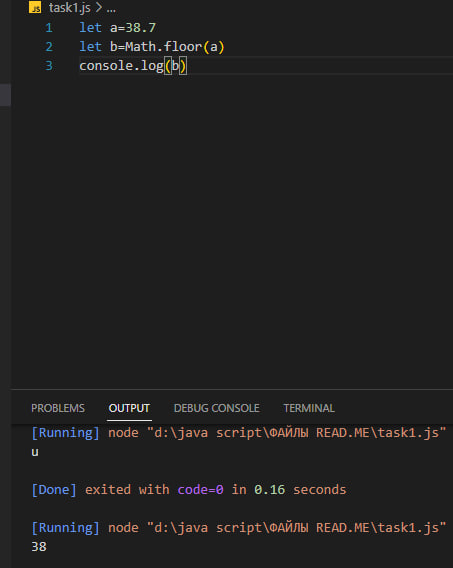

### Что такое метод в java script?
##### 
Метод — это блок кода, который запускается только при вызове.
Вы можете передавать данные, известные как параметры, в метод.
Методы используются для выполнения определенных действий, и они
также известные как функции.

### String в
java script 

##### 
Кавычки
В JavaScript есть разные типы кавычек.

Строку можно создать с помощью одинарных, двойных либо обратных кавычек:

######
Одинарные и двойные кавычки работают, по сути, одинаково, а если использовать обратные кавычки, то в такую строку мы сможем вставлять произвольные выражения, обернув их в ${…}:

Ещё одно преимущество обратных кавычек — они могут занимать более одной строки, вот так:

Выглядит вполне естественно, не правда ли? Что тут такого? Но если попытаться использовать точно так же одинарные или двойные кавычки, то будет ошибка:

Одинарные и двойные кавычки в языке с незапамятных времён: тогда потребность в многострочных строках не учитывалась. Что касается обратных кавычек, они появились существенно позже, и поэтому они гибче.

Обратные кавычки также позволяют задавать «шаблонную функцию» перед первой обратной кавычкой. Используемый синтаксис: func`string`. Автоматически вызываемая функция func получает строку и встроенные в неё выражения и может их обработать. Подробнее об этом можно прочитать в документации. Если перед строкой есть выражение, то шаблонная строка называется «теговым шаблоном». Это позволяет использовать свою шаблонизацию для строк, но на практике теговые шаблоны применяются редко.

### Спецсимволы
##### 
Многострочные строки также можно создавать с помощью одинарных и двойных кавычек, используя так называемый «символ перевода строки», который записывается как \n:

### JAVA SCRIPT STRING METHODS (МЕТОДЫ СВЯЗАННЫЕ СО STRING)

### Строковый метод JavaScript charAt()

##### 
Метод charAt() возвращает символ с указанным индексом (позицией) в строке.
Индекс первого символа 0, второго 1,...
Индекс последнего символа равен длине строки - 1 .

ПРИМЕЧАНИЕ 
МЕТОД CHARAT()-РАБОТАЕТ ТОЛЬКО С ПОЛОЖИТЕЛЬНЫМИ ЧИСЛАМИ!!!

### Строковый метод JavaScript concat()
##### 
Метод concat() объединяет две или более строк.
Метод concat() не изменяет существующие строки.
Метод concat() возвращает новую строку.

пример

### Строковый метод JavaScript replace()

##### 
Метод replace() ищет в строке значение или регулярное выражение.
Метод replace() возвращает новую строку с замененными значениями.
Метод replace() не изменяет исходную строку.

примеры:

### Строковый метод JavaScript replaceAll()
#####
Метод replaceAll() возвращает новую строку, в которой все совпадения шаблона заменены на
то что надо заменить.

### ### Строковый метод JavaScript split()
###### Метод split() разбивает строку на массив подстрок. Метод split() возвращает новый
множество. Метод split() не изменяет исходную строку. Если в качестве разделителя используется (" "), строка
делится между словами.т.е менят формат строки на массив,
примеры:

###   Строковый метод JavaScript substring(start,end)
##### Метод substring() извлекает символы между двумя индексами (позициями) из строки и
возвращает подстроку.
Метод substring() извлекает символы от начала до конца (эксклюзивно).
Метод substring() не изменяет исходную строку.
Если start больше end, аргументы меняются местами: (4, 1) = (1, 4).
Начальное или конечное значения меньше 0 обрабатываются как 0.

Примеры:

### Строковый метод JavaScript  toLowerCase()
##### 
Метод toLowerCase() преобразует строку в строчные буквы.
Метод toLowerCase() не изменяет исходную строку.
припер:

### Строковый метод JavaScript toUpperCase()
##### 
Метод toUpperCase() преобразует строку в прописные буквы, используя текущую локаль.
Метод toUpperCase() не изменяет исходную строку.

ПРИМЕР:

###  Строковый метод JavaScript method trim()
##### 
Метод trim() удаляет пробелы с обеих сторон строки.
Метод trim() не изменяет исходную строку.

Пример:

### Строковый метод JavaScript method includes()
##### 
Метод include() возвращает true, если строка содержит указанную строку.
В противном случае он возвращает ложь.
Метод include() чувствителен к регистру. т.е проверяет есть ли в строке заданное слово!!!

ПРимер:

### Строковый метод JavaScript method  toString()
##### 
Метод toString() возвращает строку, представляющую объект.
По умолчанию toString() не принимает параметров.

Пример:

### Строковый метод JavaScript method  charAt()
##### Метод indexOf() возвращает позицию первого вхождения значения в строку.
Метод indexOf() возвращает -1, если значение не найдено.
Метод indexOf() чувствителен к регистру.т.e возвращает индекс строки
  
Пример:

### Строковый метод JavaScript method  repeat()
##### 
Метод repeat() создает новую строку, повторяя заданную строку заданное количество раз.
раз и возвращает его.

ПРимер:

### Строковый метод JavaScript method  at()
##### Метод at() принимает целочисленное значение и возвращает новую строку.
Этот метод позволяет использовать положительные и отрицательные целые числа. Количество отрицательных целых чисел
назад от последнего символа строки.

пример:

## JavaScript Number methods

### javaScript Number methods Math.round(),ceil(),floor()

Функция Math.floor() округляет число до следующего наименьшего целого числа.

Пример:

Функция Math.round() возвращает число, округленное до ближайшего целого числа
т.е округляет число если число (37,6) то округлит до (38) а если число(37,4)то округлит до 36
пример: 

Метод ceil() округляет десятичное число до следующего наибольшего целого числа и возвращает его.

пример:

### JavaScript Number methods Math.max() and Math.min()
##### 
Метод max() находит максимальное значение среди указанных значений и возвращает его.

Пример:

Метод min() находит минимальное значение среди указанных значений и возвращает его.

Пример:

### Числовые методы JavaScript Math.pow() и Math.sqrt()
Chislovyye metody JavaS

##### Метод pow() вычисляет степень числа, увеличивая второй аргумент.
в степени первого аргумента.

Пример:

Метод sqrt() вычисляет квадратный корень указанного числа и возвращает его.

Пример:

### 
Строковый метод JavaScript Math.abs() и Math.random()

##### Метод abs() находит абсолютное значение указанного числа (без знака) и возвращает его.

Пример:

Функция Math.random() возвращает псевдослучайное число с плавающей точкой от 0 (включительно)
и 1 (исключительно).

Пример:

### 
Метод числа JavaScript isNaN()

##### 
Функция isNaN() проверяет, является ли значение NaN (Not-a-Number) или нет.

Пример:

